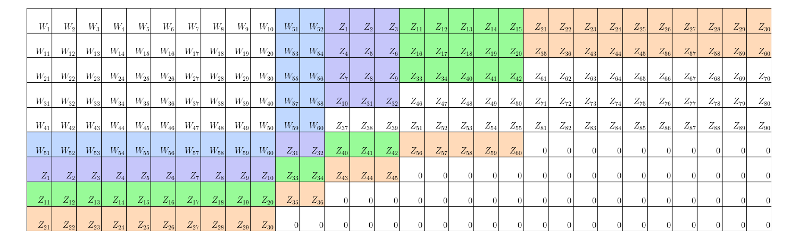

# Display for Robust Dynamic Coded Distributed Storage Message Matrix
# 动态鲁邦分布式存储编码矩阵的直观显示

### Introduction
**Implementation and visualization of the SCGen algorithm**

The related paper is https://arxiv.org/abs/2408.11467.
[1] Jia H, Jia Z. How to Read and Update Coded Distributed Storage Robustly and Optimally?[J]. arXiv preprint arXiv:2408.11467, 2024.

### How to use
**main.py**
Choose your system parameter N, R_r, K_c and the program will show the symbolic Message Matrix generated by SCGen, proposed by [1].

